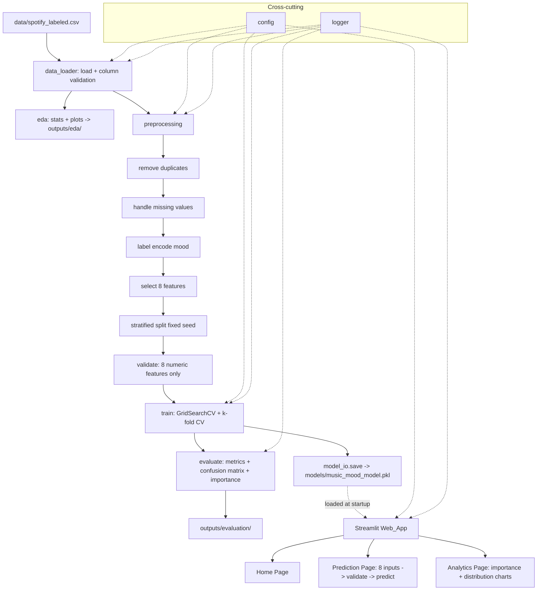

# Design Document

## Overview

The Music Mood Predictor is an end-to-end supervised machine learning application that classifies a song into one of four mood classes — **Happy, Sad, Calm, Energetic** — from eight numeric audio features. It is built as a modular Python project spanning the full ML lifecycle: dataset ingestion, exploratory data analysis (EDA), preprocessing, Random Forest training with hyperparameter tuning and cross-validation, evaluation, model persistence, a multi-page Streamlit web application, production hardening (logging, validation, pinned dependencies), source control setup, professional documentation, and public deployment.

The design is derived directly from the 15 approved requirements. It targets a confirmed dataset (`spotify_labeled.csv`) with a verified schema, and is intended to be a portfolio-quality university mini project with maintainable, testable code.

### Confirmed Dataset

The design targets a user-supplied dataset located outside the workspace at `C:/Users/Soham/Downloads/spotify_labeled (1).csv`. During implementation this file is copied into the workspace as `data/spotify_labeled.csv` (Requirement 2.1). Its verified schema is:

| Column | Type | Observed range / values | Notes |
|---|---|---|---|
| danceability | float | ~0.13 – 0.98 | roughly 0–1 |
| energy | float | ~0.0016 – 0.99 | roughly 0–1 |
| valence | float | ~0.03 – 0.98 | roughly 0–1 |
| tempo | float | ~49 – 210 | BPM, NOT 0–1 |
| loudness | float | ~ -43 – +1.3 | dB, mostly negative, NOT 0–1 |
| acousticness | float | 0 – 1 | 0–1 |
| speechiness | float | ~0.023 – 0.66 | low, stays well under 1 |
| instrumentalness | float | 0 – ~0.97 | 0–1 |
| mood | string | {Happy, Sad, Calm, Energetic} | Target_Column, 4 classes |

Dataset characteristics that drive the design:
- **Small dataset**: well under 4.5 MB, roughly a thousand-plus rows.
- **Duplicate rows** are present → preprocessing must remove duplicates (Requirement 4.1).
- **Class imbalance**: Calm and Energetic appear more common than Happy/Sad, with Sad least common. This is addressed with a **stratified train/test split** and `class_weight="balanced"` on the classifier, and is noted explicitly in EDA output.

### Input Validation Ranges

Because tempo and loudness are not on a 0–1 scale, per-feature validation ranges are defined (used by both the preprocessing validation and the Web_App input validation, Requirements 9.7 and 12.4):

| Feature | Min | Max |
|---|---|---|
| danceability | 0.0 | 1.0 |
| energy | 0.0 | 1.0 |
| valence | 0.0 | 1.0 |
| tempo | 0.0 | 250.0 |
| loudness | -60.0 | 5.0 |
| acousticness | 0.0 | 1.0 |
| speechiness | 0.0 | 1.0 |
| instrumentalness | 0.0 | 1.0 |

Ranges are slightly wider than observed data to tolerate valid real-world inputs while still rejecting nonsense values.

## Architecture

### System Architecture

The system is organized into three logical layers on top of a shared configuration/utilities layer:

1. **Data & Model Pipeline (offline / batch)** — runs once (or on retrain) to produce artifacts: cleaned data, EDA plots, evaluation plots, and the serialized model `music_mood_model.pkl`.
2. **Serving Layer (online)** — the Streamlit Web_App loads the persisted model and serves interactive predictions and analytics.
3. **Cross-cutting concerns** — configuration (feature list, ranges, paths, seed), logging, and error handling used by all modules.

The pipeline and the serving layer are decoupled: the Web_App depends only on the persisted model artifact and metadata, never on the training code path at request time.

### Modular Folder Structure (Requirements 1.4, 12.1, 13.3)

```
music-mood-predictor/
├── data/
│   └── spotify_labeled.csv          # copied dataset
├── src/
│   ├── __init__.py
│   ├── config.py                    # features, ranges, class names, paths, seed
│   ├── logger.py                    # configured Logger (timestamp + severity)
│   ├── data_loader.py               # load + column validation
│   ├── eda.py                       # EDA_Module: stats + saved plots
│   ├── preprocessing.py             # Preprocessing_Module: clean/encode/split/validate
│   ├── train.py                     # Training_Module: tune + CV + fit
│   ├── evaluate.py                  # metrics, confusion matrix, feature importance
│   ├── model_io.py                  # save/load model + metadata
│   └── validation.py                # shared input range validation
├── app/
│   ├── streamlit_app.py             # entry point + navigation
│   └── pages_content.py             # Home / Prediction / Analytics render helpers
├── models/
│   └── music_mood_model.pkl         # serialized Mood_Model (+ metadata)
├── outputs/
│   ├── eda/                         # saved EDA plots
│   └── evaluation/                  # confusion matrix, feature importance plots
├── docs/
│   └── project_plan.md              # problem statement, objectives, scope, roadmap
├── tests/
│   ├── test_properties.py           # property-based tests
│   └── test_units.py                # example/edge-case unit tests
├── run_pipeline.py                  # orchestrates EDA → preprocess → train → evaluate → save
├── requirements.txt                 # pinned dependencies
├── .gitignore
├── LICENSE
└── README.md
```

### Data-Flow / Workflow Diagram



### Technology Stack (Requirement 1.3)

| Concern | Technology | Pinned example version |
|---|---|---|
| Language | Python | 3.11 |
| Data handling | pandas | 2.2.2 |
| Numerics | numpy | 1.26.4 |
| ML / model | scikit-learn (RandomForestClassifier, GridSearchCV, StratifiedKFold) | 1.4.2 |
| Plotting | matplotlib | 3.8.4 |
| Statistical plots | seaborn | 0.13.2 |
| Persistence | joblib | 1.4.2 |
| Web app | streamlit | 1.35.0 |
| Testing | pytest | 8.2.0 |
| Property testing | hypothesis | 6.100.0 |

Exact versions are locked in `requirements.txt` (Requirement 12.5). scikit-learn provides the Random Forest, tuning, and CV — no ML algorithm is implemented from scratch.

## Components and Interfaces

### config.py

Single source of truth for shared constants.

```python
FEATURES: list[str] = [
    "danceability", "energy", "valence", "tempo",
    "loudness", "acousticness", "speechiness", "instrumentalness",
]
TARGET: str = "mood"
MOOD_CLASSES: list[str] = ["Happy", "Sad", "Calm", "Energetic"]
FEATURE_RANGES: dict[str, tuple[float, float]] = {
    "danceability": (0.0, 1.0), "energy": (0.0, 1.0), "valence": (0.0, 1.0),
    "tempo": (0.0, 250.0), "loudness": (-60.0, 5.0), "acousticness": (0.0, 1.0),
    "speechiness": (0.0, 1.0), "instrumentalness": (0.0, 1.0),
}
RANDOM_SEED: int = 42
TEST_SIZE: float = 0.2
DATA_PATH = "data/spotify_labeled.csv"
MODEL_PATH = "models/music_mood_model.pkl"
MOOD_DESCRIPTIONS: dict[str, str]   # per-class textual description (Req 9.5)
```

### logger.py (Requirements 12.2, 12.3)

- `get_logger(name) -> logging.Logger` returns a configured logger.
- Format includes ISO timestamp and severity level, e.g. `%(asctime)s | %(levelname)s | %(name)s | %(message)s`.
- Logs to console and to a `logs/app.log` file.

### data_loader.py (Requirement 2)

```python
def load_dataset(path: str = DATA_PATH) -> pd.DataFrame
```
- Raises `FileNotFoundError` with a descriptive message naming the path if the file is absent (2.3).
- After reading, validates presence of all 8 features + target; raises `MissingColumnError` naming the missing column(s) (2.4).
- Returns a DataFrame containing at least the 8 features and target.

### eda.py (Requirement 3)

```python
def run_eda(df: pd.DataFrame, out_dir: str = "outputs/eda") -> EdaReport
```
- `EdaReport` dataclass: `row_count`, `col_count`, `dtypes`, `missing_counts`, `duplicate_count`, `class_distribution`, `feature_summary` (describe per feature).
- Generates and saves plots: mood class distribution (bar), audio feature distributions (histograms), feature correlation matrix (heatmap) → PNG files in `out_dir` (3.6, 3.7).

### preprocessing.py (Requirement 4)

```python
@dataclass
class SplitData:
    X_train: pd.DataFrame; X_test: pd.DataFrame
    y_train: np.ndarray;   y_test: np.ndarray
    label_encoder: LabelEncoder

def preprocess(df: pd.DataFrame, test_size=TEST_SIZE, seed=RANDOM_SEED) -> SplitData
def encode_labels(moods: pd.Series) -> tuple[np.ndarray, LabelEncoder]
def validate_features(X: pd.DataFrame) -> None   # raises on non-numeric / wrong columns
```
- Removes duplicate rows (4.1).
- Missing-value strategy: drop rows with missing target; impute missing feature values with the training-set median (documented, produces no missing values) (4.2).
- Label-encodes `mood` to integers (4.3).
- Selects exactly the 8 features (4.4).
- Stratified split on the encoded label with fixed seed (4.5, addresses class imbalance).
- Post-split validation: feature frames contain exactly the 8 features and only numeric dtypes (4.6).

### train.py (Requirement 5)

```python
def train_model(X_train, y_train, seed=RANDOM_SEED) -> TrainResult
```
- `RandomForestClassifier(class_weight="balanced", random_state=seed)` only (5.1, 5.4).
- `GridSearchCV` over `n_estimators`, `max_depth`, `min_samples_split`, `max_features` (5.2).
- `StratifiedKFold` cross-validation; reports mean and std of CV accuracy (5.3).
- `TrainResult`: fitted `model`, `best_params`, `cv_mean`, `cv_std`.

### evaluate.py (Requirement 6)

```python
def evaluate_model(model, X_test, y_test, label_encoder, out_dir="outputs/evaluation") -> EvalReport
```
- Computes accuracy, precision, recall, F1 (macro + per class) (6.1).
- Confusion matrix over 4 classes (6.2); classification report per class (6.3).
- Feature importances for the 8 features (6.4).
- Saves confusion matrix and feature importance plots as PNGs (6.5).

### model_io.py (Requirement 7)

```python
def save_model(model, label_encoder, metadata: dict, path=MODEL_PATH) -> None
def load_model(path=MODEL_PATH) -> ModelBundle   # raises descriptive error if missing (7.4)
```
- Persists a bundle `{model, label_encoder, feature_order, metadata}` via joblib to `music_mood_model.pkl` (7.1).
- `ModelBundle` exposes `predict(features: dict) -> Prediction`.
- Round-trip guarantee: `load(save(m))` yields identical predictions (7.3 — property tested).

### validation.py (Requirements 9.7, 12.4)

```python
def validate_input(values: dict[str, float]) -> list[ValidationError]
```
- Checks each of the 8 features is numeric and within `FEATURE_RANGES`.
- Returns a list of per-field errors (empty list = valid). Prediction is withheld while errors exist.

### app/streamlit_app.py (Requirements 8–11)

- Sidebar navigation across **Home**, **Prediction**, **Analytics** (8.3).
- Loads `ModelBundle` once at startup with `@st.cache_resource`; shows a descriptive error if the model file is missing (7.2, 7.4).
- Applies a consistent theme via `.streamlit/config.toml` and shared CSS; images carry alt/caption text (11.1, 11.2).

#### Visual Design Language (reference-driven)

The UI follows a modern **dark glassmorphism** aesthetic inspired by the provided music-player reference:

- **Palette**: near-black backgrounds (`#0B0B0F`–`#141018`) with purple/magenta gradient accents (`#7B2FF7` → `#E052A0`) and soft white text.
- **Glass cards**: frosted, semi-transparent panels with `backdrop-filter: blur(...)`, subtle 1px light borders, and large corner radii (16–24px) for prediction inputs, result cards, and analytics tiles.
- **Accents & glow**: gradient buttons and glowing focus rings; the predicted mood is shown in a prominent glass "result" card with a mood-colored glow (e.g., Happy = warm gradient, Sad = cool blue, Calm = teal/violet, Energetic = magenta).
- **Navigation**: a rounded pill-style nav bar for Home / Prediction / Analytics echoing the reference's bottom nav.
- **Typography**: clean sans-serif, generous spacing, large headings.
- Delivered through `.streamlit/config.toml` (base theme, primary color, fonts) plus injected custom CSS in `app/pages_content.py`. Contrast ratios are kept accessibility compliant and images/plots carry captions/alt text (11.2).

Prediction page interface:
- One input widget per feature with range hints (9.1).
- Predict button (9.2) → runs `validate_input`; on error, shows field-specific validation messages and withholds prediction (9.7); on success, shows predicted Mood_Class (9.3), Confidence_Score as a percentage (9.4), mood description (9.5), and a summary table of submitted values (9.6).

### Prediction contract

```python
@dataclass
class Prediction:
    mood: str            # one of MOOD_CLASSES
    confidence: float    # in [0, 100]
    probabilities: dict[str, float]
```

## Data Models

### Raw dataset row
8 float audio features + `mood` string label (see schema table above).

### SplitData
Training/test feature frames (8 numeric columns), integer-encoded label arrays, and the fitted `LabelEncoder`.

### ModelBundle (persisted)
```
{
  "model": RandomForestClassifier,
  "label_encoder": LabelEncoder,
  "feature_order": list[str],     # canonical 8-feature order
  "metadata": {
      "cv_mean": float, "cv_std": float, "best_params": dict,
      "test_accuracy": float, "test_f1": float,
      "trained_at": iso8601, "sklearn_version": str
  }
}
```

### Prediction
`mood` (one of the 4 classes), `confidence` (0–100), and full class-probability map.

### EdaReport / EvalReport
In-memory dataclasses holding the computed statistics plus paths to saved plot images.

## Correctness Properties

*A property is a characteristic or behavior that should hold true across all valid executions of a system — essentially, a formal statement about what the system should do. Properties serve as the bridge between human-readable specifications and machine-verifiable correctness guarantees.*

The properties below were derived from the acceptance criteria prework. Non-functional, documentation, UI-rendering, side-effect, and infrastructure criteria (Requirements 1.1–1.4, 2.1, 3.6–3.7, 6.5, 7.1, 8.x, 10.x, 11.x, 12.5–12.6, 13.x, 14.x, 15.x) are validated by example/smoke tests and manual review, not by property-based tests. Redundant invariants identified during reflection were consolidated (e.g., the post-preprocessing invariants are combined into a single property; the prediction class-membership and confidence-range checks are combined into one output-contract property).

### Property 1: Preprocessing output invariants

*For any* raw dataset containing the eight Audio_Features and the Target_Column (possibly with duplicate rows and missing values), after preprocessing completes the resulting training and test feature sets SHALL contain exactly the eight Audio_Features, only numeric values, and no missing values.

**Validates: Requirements 4.1, 4.2, 4.4, 4.6**

### Property 2: Label encoding round-trip

*For any* sequence of Mood_Class labels drawn from {Happy, Sad, Calm, Energetic}, encoding the labels to integers and then inverse-transforming SHALL reproduce the original labels exactly.

**Validates: Requirements 4.3**

### Property 3: Split reproducibility and partition

*For any* dataset and a fixed random seed, splitting into training and test sets SHALL be reproducible (identical splits across runs with the same seed), and the training and test sets together SHALL partition all rows with no overlap.

**Validates: Requirements 4.5**

### Property 4: Missing required column detection

*For any* dataset that is missing at least one required column (an Audio_Feature or the Target_Column), loading SHALL raise a descriptive error that names a missing column.

**Validates: Requirements 2.4**

### Property 5: Training reproducibility with fixed seed

*For any* fixed training dataset and seed, training the Classifier twice SHALL produce models that yield identical predictions for identical Audio_Features input.

**Validates: Requirements 5.4**

### Property 6: Model save/load round-trip

*For any* trained Mood_Model and *for any* valid Audio_Features input, saving the model to `music_mood_model.pkl` and then loading it SHALL produce a model that yields identical predictions for that input.

**Validates: Requirements 7.3**

### Property 7: Prediction output contract

*For any* valid in-range Audio_Features input, the prediction SHALL return exactly one Mood_Class from {Happy, Sad, Calm, Energetic} and a Confidence_Score that lies within the interval [0, 100] and equals the maximum class probability expressed as a percentage.

**Validates: Requirements 1.5, 9.3, 9.4**

### Property 8: Input validation partitions valid and invalid inputs

*For any* Audio_Features input in which at least one feature is non-numeric or outside its defined valid range, validation SHALL return an error identifying an offending feature and the prediction SHALL be withheld; and *for any* input in which all eight features are numeric and within range, validation SHALL return no errors.

**Validates: Requirements 9.7, 12.4**

## Error Handling

The system uses a consistent, layered error-handling strategy so that failures are logged (with timestamp and severity) and surfaced with descriptive messages (Requirements 12.2, 12.3).

| Failure | Layer | Behavior |
|---|---|---|
| Dataset file missing | data_loader | Raise `FileNotFoundError` naming the expected path (2.3); logged at ERROR. |
| Required column missing | data_loader | Raise `MissingColumnError` naming the missing column(s) (2.4); logged at ERROR. |
| Missing values in rows | preprocessing | Drop rows with missing target; median-impute missing features → no missing values remain (4.2); logged at INFO with counts. |
| Model file missing at startup | app / model_io | Streamlit displays a descriptive error banner ("Model file `music_mood_model.pkl` not found — run the training pipeline") and halts prediction (7.4); logged at ERROR. |
| Invalid / out-of-range prediction input | validation / app | Show per-field validation messages, withhold prediction until corrected (9.7, 12.4). |
| Unexpected error during data/model/prediction op | all modules | Caught at operation boundary, logged via Logger with stack context, and a descriptive message displayed/returned (12.2). |

- **Logger configuration**: single `logging` setup in `logger.py`; format `%(asctime)s | %(levelname)s | %(name)s | %(message)s`; handlers for console + `logs/app.log`.
- **Custom exceptions**: `MissingColumnError`, `ModelFileNotFoundError` for precise, descriptive messaging.
- **Streamlit boundaries**: prediction and page-load actions wrapped in try/except that logs and renders `st.error(...)` rather than crashing the app.

## Testing Strategy

A dual approach is used: **property-based tests** validate the universal properties above across many generated inputs, and **example/edge-case unit tests** cover specific behaviors, UI wiring, error conditions, and file/side-effect outputs.

### Property-Based Testing

- **Library**: `hypothesis` (Python). No property-based framework is implemented from scratch.
- **Location**: `tests/test_properties.py`.
- **Iterations**: each property test runs a minimum of **100 iterations** (`@settings(max_examples=100)`).
- **Generators**:
  - Audio_Features: `st.fixed_dictionaries` mapping each feature to `st.floats` bounded by its `FEATURE_RANGES` entry (in-range generator) and an out-of-range/non-numeric generator for validation tests.
  - Datasets: build small pandas DataFrames from lists of feature rows + random mood labels, with strategies to inject duplicates and NaNs.
  - Label sequences: `st.lists(st.sampled_from(MOOD_CLASSES))`.
- **Tagging**: each property test is tagged with a comment referencing its design property, format:
  `# Feature: music-mood-predictor, Property {number}: {property_text}`
- **Coverage mapping**:
  - Property 1 → preprocessing invariants test
  - Property 2 → label encoding round-trip test
  - Property 3 → split reproducibility & partition test
  - Property 4 → missing-column detection test
  - Property 5 → training reproducibility test (small grid / reduced estimators for speed)
  - Property 6 → save/load round-trip test
  - Property 7 → prediction output-contract test
  - Property 8 → input-validation partition test

Each correctness property is implemented by a **single** property-based test.

### Unit / Example / Edge-Case Tests

Location: `tests/test_units.py`. Kept focused (property tests handle broad input coverage):
- **Examples**: dataset loads expected columns (2.2); trained model is a `RandomForestClassifier` (5.1); `best_params` fall within the defined grid (5.2); CV `mean ∈ [0,1]`, `std ≥ 0` (5.3); metrics in `[0,1]` and feature importances length 8 summing to ~1 (6.1, 6.4); logger record carries timestamp + severity (12.3); Streamlit page helpers return expected content and navigation (8.x, 10.x, 11.x wiring).
- **Edge cases**: missing dataset file error names the path (2.3); missing model file error is descriptive (7.4).

### Smoke / Setup Checks
- Dataset present at `data/spotify_labeled.csv` (2.1).
- EDA and evaluation produce PNG files in `outputs/` (3.7, 6.5); model artifact produced at `models/music_mood_model.pkl` (7.1).
- `requirements.txt` pins exact versions (12.5); repo contains `.gitignore`, `LICENSE`, `README.md` (13.1, 13.2); README contains required sections including the live demo URL (14.x).

### Manual / Deployment Verification
- Public deployment to Streamlit Community Cloud (Render as fallback) and the resulting live URL recorded in the README (15.x) are verified manually by visiting the deployed URL.
