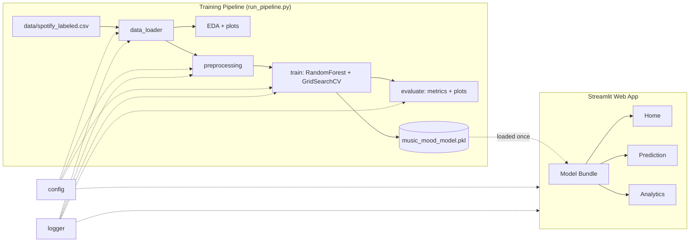
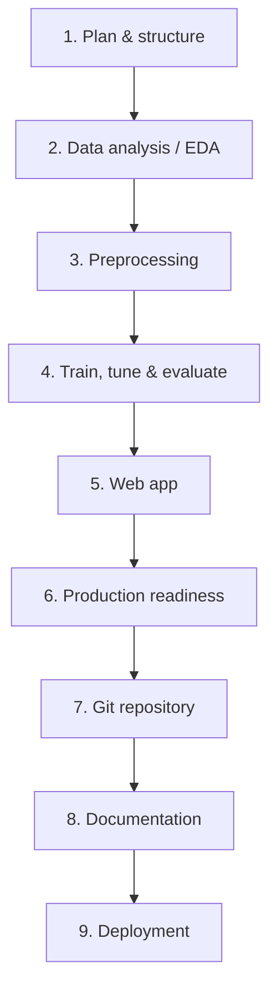
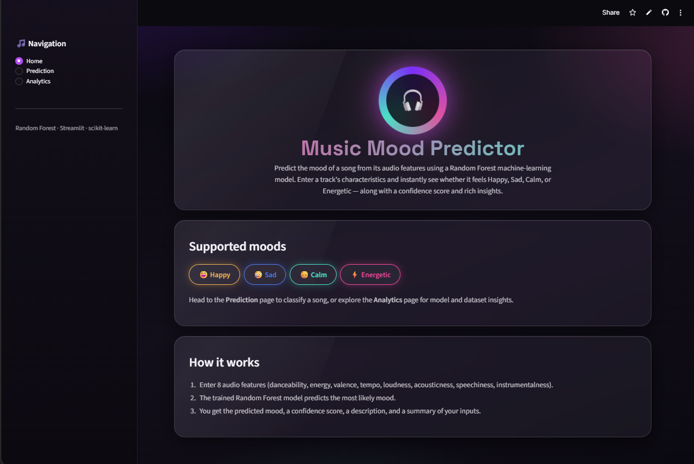
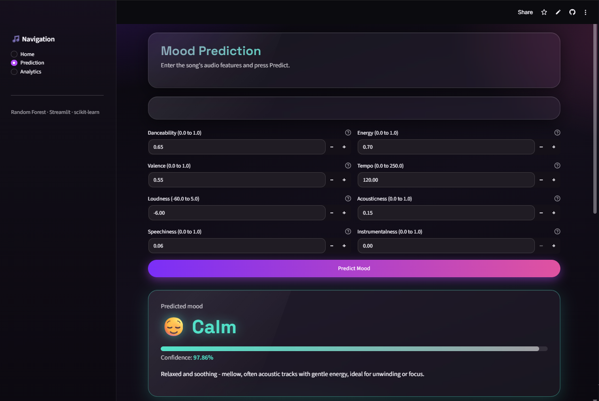

# 🎵 Music Mood Predictor

Predict the **mood of a song** — Happy, Sad, Calm, or Energetic — from its audio
features, using a **Random Forest Classifier** and an interactive **Streamlit**
web app. Built as an end-to-end, portfolio-quality machine-learning project.

[](https://ml-minip-ez2gz7r4jtn6wsglxehbec.streamlit.app/)

**🔗 Live app:** https://ml-minip-ez2gz7r4jtn6wsglxehbec.streamlit.app/

---

## 📖 Project Overview

Mood is one of the most natural ways people relate to music, yet it isn't
directly available as metadata. This project learns the relationship between a
song's objective **audio features** and its **mood**, then serves predictions
through a modern web interface with confidence scores and analytics.

The system covers the full ML lifecycle: data analysis → preprocessing → model
training/tuning/evaluation → persistence → web app → production hardening →
documentation → deployment.

## ✨ Features

- 🎯 **Mood prediction** into four classes: Happy, Sad, Calm, Energetic
- 🌲 **Random Forest** with `GridSearchCV` tuning and stratified k-fold CV
- 📊 **Analytics dashboard** — feature importance, dataset stats, and charts
- 🧪 **Input validation** with per-feature ranges and clear error messages
- 💾 **Model persistence** to `music_mood_model.pkl` (save/load round-trip safe)
- 🎨 **Dark glassmorphism UI** — purple/magenta gradients, frosted-glass cards
- 🪵 **Logging & error handling** throughout the pipeline and app
- ✅ **Property-based + unit tests** (hypothesis + pytest)

## 🛠️ Technology Stack

| Layer | Tools |
|------|-------|
| Language | Python 3.11 |
| Data | pandas, numpy |
| Machine Learning | scikit-learn (RandomForestClassifier, GridSearchCV, StratifiedKFold) |
| Visualization | matplotlib, seaborn |
| Persistence | joblib |
| Web App | Streamlit |
| Testing | pytest, hypothesis |

## 📂 Dataset Information

- **File:** `data/spotify_labeled.csv` (~1,686 rows, well under 4.5 MB)
- **Target:** `mood` ∈ {Happy, Sad, Calm, Energetic}
- **Features (8):** `danceability`, `energy`, `valence`, `tempo`, `loudness`,
  `acousticness`, `speechiness`, `instrumentalness`
- **Notes:** contains duplicate rows (removed in preprocessing) and class
  imbalance (Calm most common, Sad least) — handled with **stratified splitting**
  and a **class-weight-balanced** classifier.

## 🏗️ System Architecture



## 🔁 Workflow Structure & Roadmap

**End-to-end workflow:**



**Development roadmap:**

| Phase | Deliverable | Status |
|------|-------------|--------|
| 1 | Project planning & structure | ✅ Done |
| 2 | Data analysis & EDA | ✅ Done |
| 3 | Data preprocessing | ✅ Done |
| 4 | Model training, tuning & evaluation | ✅ Done |
| 5 | Streamlit web application | ✅ Done |
| 6 | Production readiness | ✅ Done |
| 7 | GitHub repository setup | ✅ Done |
| 8 | Professional README | ✅ Done |
| 9 | Public deployment (live URL) | ✅ Done |

## 📁 Project Structure

```
music-mood-predictor/
├── data/spotify_labeled.csv        # dataset
├── src/                            # pipeline modules
│   ├── config.py                   # features, ranges, paths, seed
│   ├── logger.py                   # logging setup
│   ├── data_loader.py              # load + column validation
│   ├── eda.py                      # EDA stats + plots
│   ├── preprocessing.py            # clean / encode / split / validate
│   ├── train.py                    # RandomForest + GridSearchCV + CV
│   ├── evaluate.py                 # metrics + confusion matrix + importance
│   ├── model_io.py                 # save/load bundle + predict
│   └── validation.py               # input range validation
├── app/
│   ├── streamlit_app.py            # entry point + navigation
│   └── pages_content.py            # theme + Home/Prediction/Analytics
├── models/music_mood_model.pkl     # trained model
├── outputs/eda/ , outputs/evaluation/   # saved plots
├── docs/project_plan.md            # plan, objectives, roadmap, setup
├── tests/                          # property-based + unit tests
├── run_pipeline.py                 # orchestrates the full pipeline
├── requirements.txt · LICENSE · README.md · .gitignore
```

## ⚙️ Installation & Local Setup

```bash
# 1. Clone
git clone https://github.com/YOUR-USERNAME/music-mood-predictor.git
cd music-mood-predictor

# 2. Create & activate a virtual environment
python -m venv .venv
# Windows
.venv\Scripts\activate
# macOS/Linux
source .venv/bin/activate

# 3. Install dependencies
pip install -r requirements.txt
```

## 🚀 Usage

```bash
# (Optional) retrain the model — regenerates the .pkl and all plots
python run_pipeline.py

# Launch the web app
streamlit run app/streamlit_app.py

# Run the test suite
python -m pytest tests/ -q
```

Then open the app in your browser, go to **Prediction**, enter a song's eight
audio features, and press **Predict Mood**.

## 🤖 Model Information

- **Algorithm:** Random Forest Classifier (scikit-learn), the sole model used.
- **Tuning:** `GridSearchCV` over `n_estimators`, `max_depth`,
  `min_samples_split`, `max_features`.
- **Validation:** 5-fold `StratifiedKFold` cross-validation.
- **Best parameters:** `max_depth=10`, `max_features='log2'`,
  `min_samples_split=2`, `n_estimators=100`.
- **Reproducibility:** fixed random seed (42) for splitting and training.

## 📈 Evaluation Metrics

| Metric | Score |
|-------|-------|
| Test Accuracy | 1.00 |
| Macro Precision | 1.00 |
| Macro Recall | 1.00 |
| Macro F1 | 1.00 |
| CV Accuracy (mean ± std) | 0.996 ± 0.003 |

> The dataset is highly separable by features like `valence`, `energy`, and
> `acousticness`. Duplicate rows are removed **before** the train/test split, so
> the high scores are not the result of leakage; independent cross-validation
> corroborates the result.

Confusion matrix and feature importance plots are saved in
`outputs/evaluation/`.

## 🖼️ Screenshots

| Home | Prediction |
|------|-----------|
|  |  |

## 🌐 Live Demo

**▶️ Try it live:** https://ml-minip-ez2gz7r4jtn6wsglxehbec.streamlit.app/

The app is deployed on **Streamlit Community Cloud** and loads the trained model
directly, so predictions work instantly. Deployment instructions (Streamlit
Cloud preferred, Render alternative) are in
[`docs/DEPLOYMENT.md`](docs/DEPLOYMENT.md).

## 🔮 Future Enhancements

- Extract audio features directly from uploaded audio / Spotify track URLs
- Add more mood classes and multi-label moods
- Compare additional models and add explainability (SHAP)
- Batch prediction via CSV upload
- User accounts and saved prediction history

## 👤 Author

**Apurva** — University ML mini project.
Contributions and feedback welcome via issues and pull requests.

## 📄 License

Licensed under the [MIT License](LICENSE).
